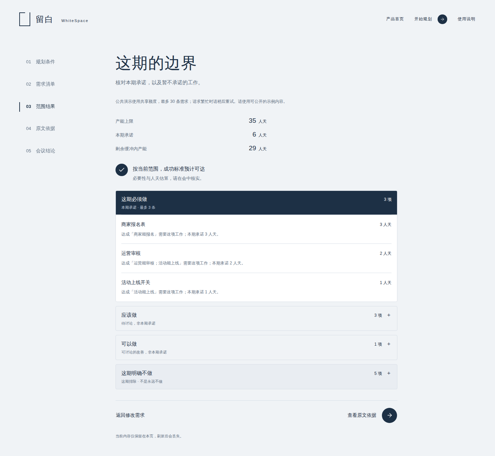
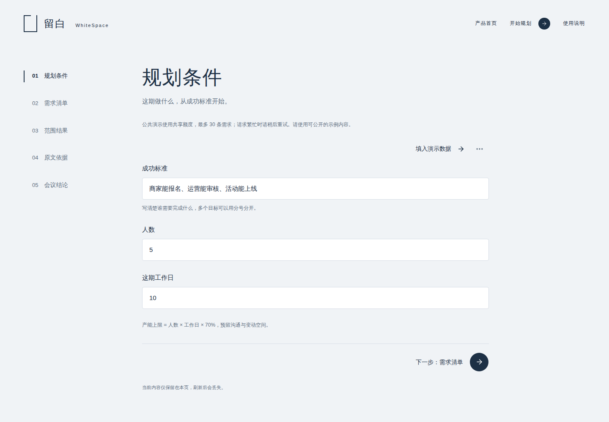
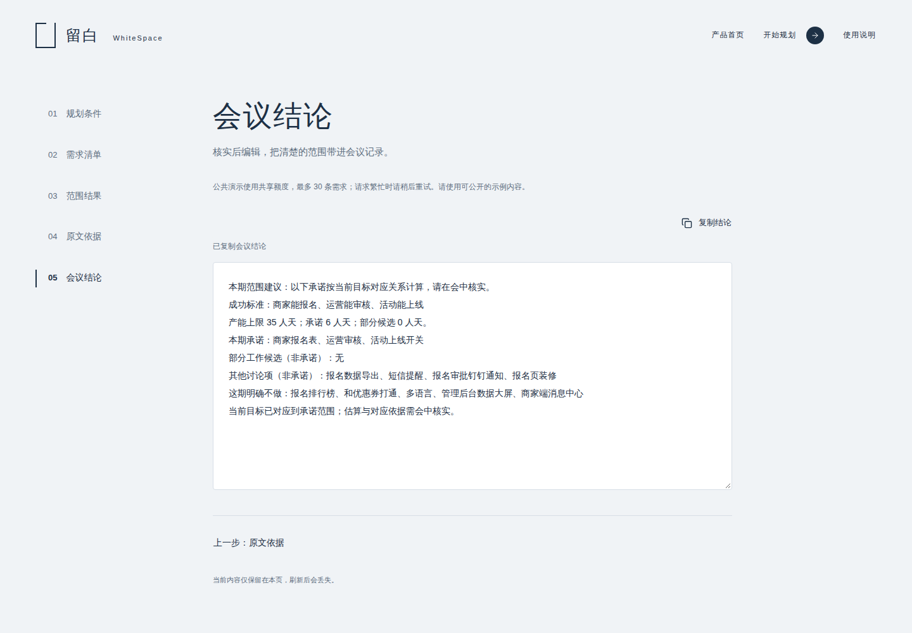
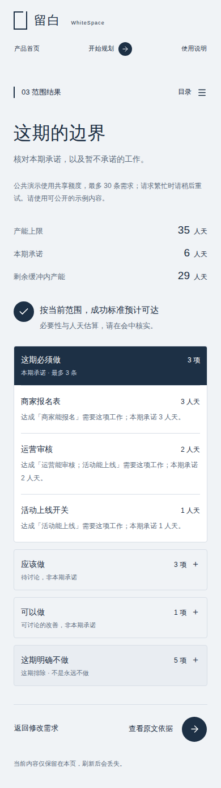

# 留白 WhiteSpace

**把一堆需求，变成这期能兑现的范围。**

[](https://github.com/hexing-ai/whitespace/actions/workflows/ci.yml)
[](LICENSE)

**[在线体验 →](https://whitespace-junz11055-8124.vercel.app)** · 无需登录，点击“用示例体验”即可开始。公共 Demo 使用真实百炼调用，有共享额度与频率限制；请勿输入业务机密。

规划会上，难的往往不是列出想做什么，而是说清楚：**这期必须做什么，为什么，以及什么先不承诺。**

留白把成功标准、需求依赖和团队产能放在一起分析，生成可核对的 MoSCoW 范围建议，并把取舍整理成一份可复制的会议结论。



[快速开始](#快速开始) · [看一次真实例子](#一分钟理解留白) · [架构与规则](docs/architecture.md) · [接口文档](docs/api.md) · [部署](docs/deployment.md)

## 一分钟理解留白

假设你要上线一场商家活动，有 12 条需求，但成功标准只有三项：**商家能报名、运营能审核、活动能上线。**

| 输入与变化 | 留白帮助你看清什么 |
| --- | --- |
| 5 人 × 10 个工作日 | 按 70% 计算可用产能为 35 人天；报名、审核、上线组成目标闭环，不为了填满产能而把所有需求塞进 Must |
| 改为 1 人 × 3 个工作日 | 产能只有 2.1 人天，完整目标不可达；本期承诺为空，部分工作候选单独标注 |
| 把“运营审核”标为本期明确不做 | 上线又依赖审核，明确报告目标冲突，不偷偷绕开排除项 |

上图来自[真实百炼调用](docs/demo.md)。模型建议会随输入与调用变化，产能限制、最多 3 条 Must、明确排除项和空承诺规则由代码执行。

## 从讨论到结论

1. **规划条件**：填写成功标准、人数和工作日。
2. **需求清单**：填写名称、说明与可选估值；明确不做的需求可以直接标记。
3. **范围结果**：查看 Must / Should / Could / Won’t、可达性、产能和部分工作候选。
4. **原文依据**：核对需求如何对应成功标准、哪些前置明确、哪些仍待确认。
5. **会议结论**：编辑并复制可带走的会议记录。

<details>
<summary>展开查看首页、输入与手机效果</summary>






</details>

## 快速开始

准备 **Node.js 22.18+（推荐最新 22 LTS）**、npm，以及可用的[阿里云百炼](https://bailian.console.aliyun.com/) API Key。准备好环境与 Key 后，按以下步骤启动；安装耗时取决于网络。

```bash
git clone https://github.com/hexing-ai/whitespace.git
cd whitespace
npm ci
cp .env.example .env.local
```

在本地 `.env.local` 中填写 `DASHSCOPE_API_KEY`，然后启动：

```bash
npm run dev
```

打开 **http://localhost:3100**，点“用示例体验”，进入需求清单后点“生成这期范围”。

默认使用百炼北京地域的 `qwen3.6-plus`。国际站 Key、模型配置、Windows 操作和错误排查见[安装说明](docs/setup.md)。没有 Key 也能浏览页面和填写需求，生成时会明确提示配置缺失。

## AI 在哪里，代码保证什么

| AI：理解输入 | 代码：执行约束 |
| --- | --- |
| 分析需求与成功标准的关系 | 校验并还原原文依据，检查目标覆盖 |
| 提取明确或待确认的依赖 | 检查前置闭合，不假设未知能力已经存在 |
| 补充未填写的工作量估值 | 计算产能，限制 Must 和候选的数量及人天 |
| 给出结构化分析 | 生成分组、事实性理由、警告与会议结论，执行明确排除项 |

**建议需要人核对。** 留白输出范围建议，不执行需求、不分派人员，也不保证自然语言分析永远准确。输入与结论保存在当前页面内存，刷新后丢失；只有“跳过引导”偏好保存在本机。生成时，成功标准和需求内容会发送给百炼。

## 技术与验证

Next.js App Router · React · TypeScript · Tailwind CSS · 阿里云百炼通义千问。单一 Node.js 应用，无数据库、登录或独立服务。

```bash
npm run typecheck
npm run lint
npm test
npm run build
npm run test:e2e
```

浏览器测试需要安装测试浏览器，见[验证说明](docs/testing.md)。`npm run test:live` 执行真实百炼回归，会产生调用费用；它与使用固定响应的自动化测试分开报告。

欢迎通过 Issue 描述规划场景和可复现的问题，提交前请移除业务机密及凭证。若留白帮助你开好一次规划会，欢迎点一个 **Star**，也让更多团队发现它。

自有代码采用 [MIT](LICENSE)，首页媒体不在该许可范围内。第三方代码及展示资源的许可边界见[第三方声明](docs/third-party.md)。
