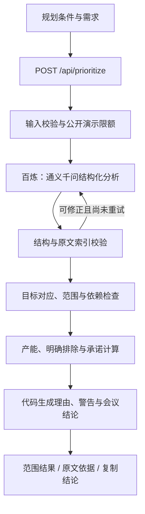

# 架构与业务规则

留白 WhiteSpace 是一个 Next.js App Router 应用。浏览器负责输入、展示与交互，Node.js Route Handler 负责百炼调用和确定性规则，无数据库、登录或独立后端服务。

## AI 与确定性规则

模型接收成功标准、需求名称与说明、可选估值和代码提取的原文片段。模型输出目标关系、依赖、范围类别与估值，通过索引引用原文。模型不负责最终承诺、事实性理由或警告。

- 产能为 `round(人数 × 工作日 × 0.7, 1)`，使用 Decimal 计算。
- Must 与部分工作候选分别最多 3 条，各自不能超过产能。二者不是可以相加的两份承诺。
- 完整目标不可达或必要前置待确认时，Must 为空；候选明确标为非本期承诺。
- 候选必须包含输入中明确的必要前置，不能假设缺失能力已经存在。
- 明确排除项由代码保留在 Won’t；若它同时是达标必要项，则报告目标冲突。
- 成功标准有逐项覆盖信息。仅有关联不等于必要前置，信息不足则标为待确认。
- Should、Could 以及候选都不构成本期承诺。

以上规则在独立冻结场景和单元测试中验证。模型仍可能误解新的表达方式；不通过结构或业务校验的输出会被拒绝，而不是原样展示。

## 请求生命周期

1. 请求体最多 64 KiB，服务端校验人数、工作日、成功标准及至少两条唯一编号需求。
2. 公共 Demo 额外限制输入规模、并发与频率；本地默认关闭 Demo 限制。
3. OpenAI SDK 仅连接白名单中的百炼 compatible-mode 地址，禁止 HTTP 重定向，不使用 SDK 自动重试。
4. 单次超时默认 30 秒，总预算 65 秒，最多两次模型请求；认证、配置和不可恢复请求错误不重试。
5. 响应带 `Cache-Control: no-store` 与 `X-Request-Id`；对外只返回受控错误。日志记录耗时、模型、Token 用量和状态，不记录 Key 或完整输入输出。
6. 前端校验传输结构，保留失败时的输入。修改输入后旧结果失效；取消等待或导航退出后，旧响应不会覆盖当前页面。

## 页面与状态

单一路由 `/` 内切换产品首页和五个工作视图：规划条件、需求清单、范围结果、原文依据、会议结论。目录用于切换当前视图，不将多个步骤挤在同一屏。

状态包括初始化、空输入、分析中、待确认、可达、不可达、目标冲突、请求失败与重试。刷新清空规划内容，仅“跳过引导”偏好写入 localStorage。

## 代码地图

| 位置 | 职责 |
| --- | --- |
| `src/features/home/` | 首页、滚动视频帧、移动端静态回退 |
| `src/features/planner/` | 五视图、表单状态、API 客户端、结果与复制 |
| `src/app/api/prioritize/route.ts` | HTTP 边界与请求生命周期 |
| `src/lib/qwen.ts`、`prompt.ts` | 百炼配置、结构化分析与有限重试 |
| `src/lib/input.ts`、`contracts.ts` | 输入校验和公开数据契约 |
| `src/lib/goals.ts`、`dependency-policy.ts`、`scope-policy.ts`、`planning.ts` | 目标、依赖、范围与承诺规则 |
| `src/lib/demo-guard.ts` | 公共 Demo 的输入与实例内调用限制 |
| `tests/` | 独立场景、规则测试、API 与浏览器测试 |

首页的帧解码、Canvas 和视频会在进入工作台后清理。保留的水墨组件属于可复用组件，当前首页不加载它。
