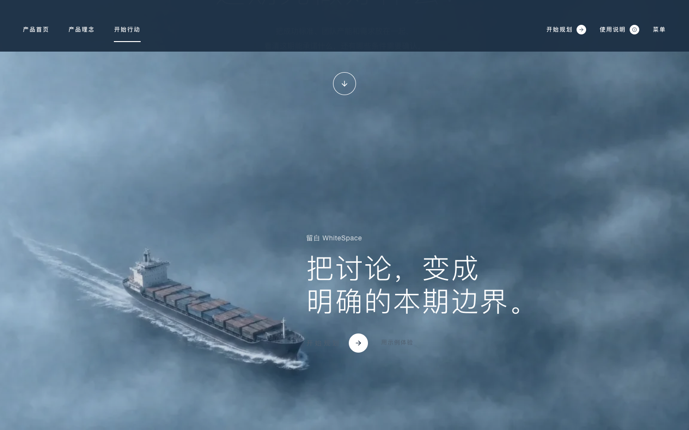

# 留白 WhiteSpace v1.3.1

恢复原雪山→云雾→海面三幕全屏首页，按滚动进度切换正文。首页组件、样式、控制器和图片加载器与自然滚动改版前的48617c1版本一致。

邀请码保护、后端、工作台源码与v1.3.0保持一致；不回退整个仓库或生产环境变量。页面保留随时开始规划、返回产品首页和工作台输入。

## 验证

290项单元测试、34项完整浏览器测试、类型检查、Lint和生产构建通过。真实浏览器查看三幕与章节导航；当前邀请码与工作台回归通过。本地生产冷／热首背景帧943／900ms，背景绘制间隔P95≤34ms，静止RAF为0，位图上限24；受限网络2.85秒降级到静态，入口可用。最终独立CI同样通过290项单元与34项浏览器检查。线上首页与邀请码保护均通过。本次不重复付费百炼调用。

## 限制

恢复旧版媒体加载与平滑策略，弱网可能降级到静态阅读，不承诺消除原版全部卡顿。触屏、小屏和减少动态效果沿用静态模式。Safari和实体手机未全面验证，原媒体许可范围仍见[第三方声明](third-party.md)。

## 线上记录

- 运行时代码：`c9fba603336a6ff34fcf24396f01dec062c7b005`；生产部署：`dpl_Bq4aNRH8fK76evPVhsLeZBsKXoWM`，两个正式域名已指向此版本。
- [独立CI](https://github.com/hexing-ai/whitespace/actions/runs/34246353256)：类型、Lint、290单元、34浏览器与构建通过。
- [线上首页](https://github.com/hexing-ai/whitespace/actions/runs/34246620543)：冷／热首背景帧1363／1007ms；背景绘制间隔P95最慢66.8ms，静止RAF为0，位图上限24，无页面错误。受限网络2.97秒降级静态，入口可用。单次样本，不代表所有网络或设备。
- [线上邀请码保护](https://github.com/hexing-ai/whitespace/actions/runs/34246627674)：匿名与篡改会话拒绝、错误邀请码拒绝、有效邀请码、安全Cookie、防猜测与生成限流、旧部署阻断均通过。未发起付费模型生成。

